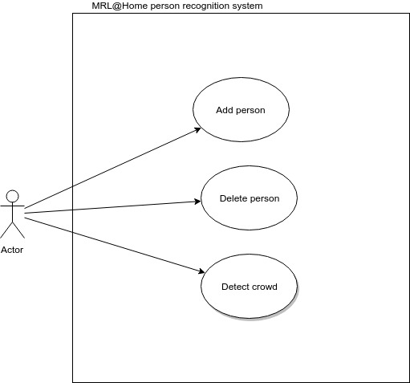

# Person Recognition
This project is aimed to recognize a person. it uses CNN(convulotional neural network) for this purpose. The input data comes from camera.

Prerequisites:
ROS Kinetic --> http://wiki.ros.org/kinetic/Installation/Ubuntu
Tensorflow > 1.80 --> https://www.tensorflow.org/install/
needed packages such as numpy, opencv, ...

building the package:
-cloning the project from https://gitlab.com/MRL-AtHome/person_recognition 
-making a ros workspace --> 
$ mkdir -p ~/<workspace-name>/src
$ cd ~/<workspace-name>/
$ catkin_make
$ source devel/setup.bash
for more information go to http://wiki.ros.org/catkin/workspaces
-cloning the project in the workpace from https://gitlab.com/MRL-AtHome/person_recognition
-building the project -->
$ catkin_make
$ catkin_make install
-source the environment setup for ros -->
$ source /opt/ros/kinetic/setup.bash 
-source the environment setup for the package -->
$ source %YOUR_WORKSPACE_LOCATION%/devel/setup.bash

running the nodes:
-runnig the roscore node -->
$ roscore
-running the package nodes -->
$ rosrun person_recognition image_publisher.py
$ rosrun person_recognition start.py
-run ros 3D visualizer -->
& rosrun rviz rviz

now you can see the input and output image.
you can add a name to the recognized face -->
$ rosservice call person_recognition "name:['%THE_NAME%']"

## System Use Cases

